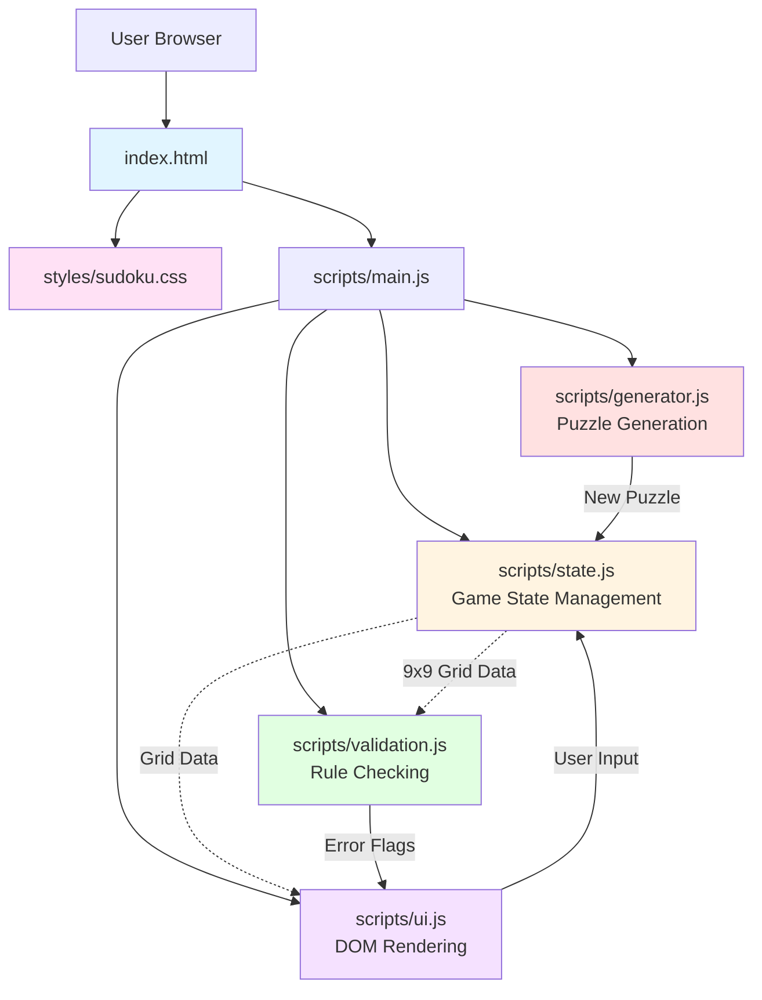
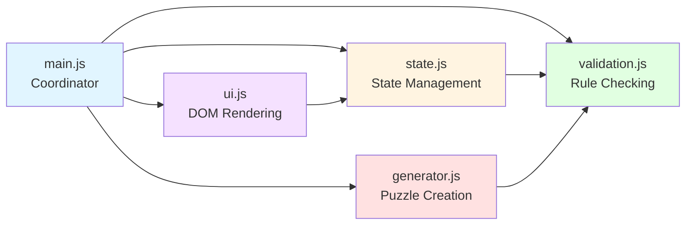
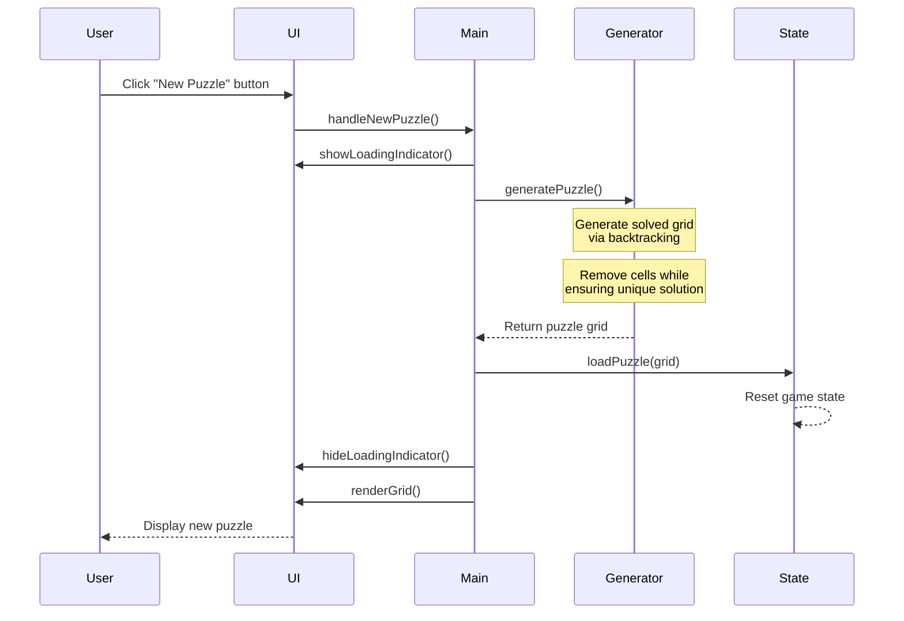
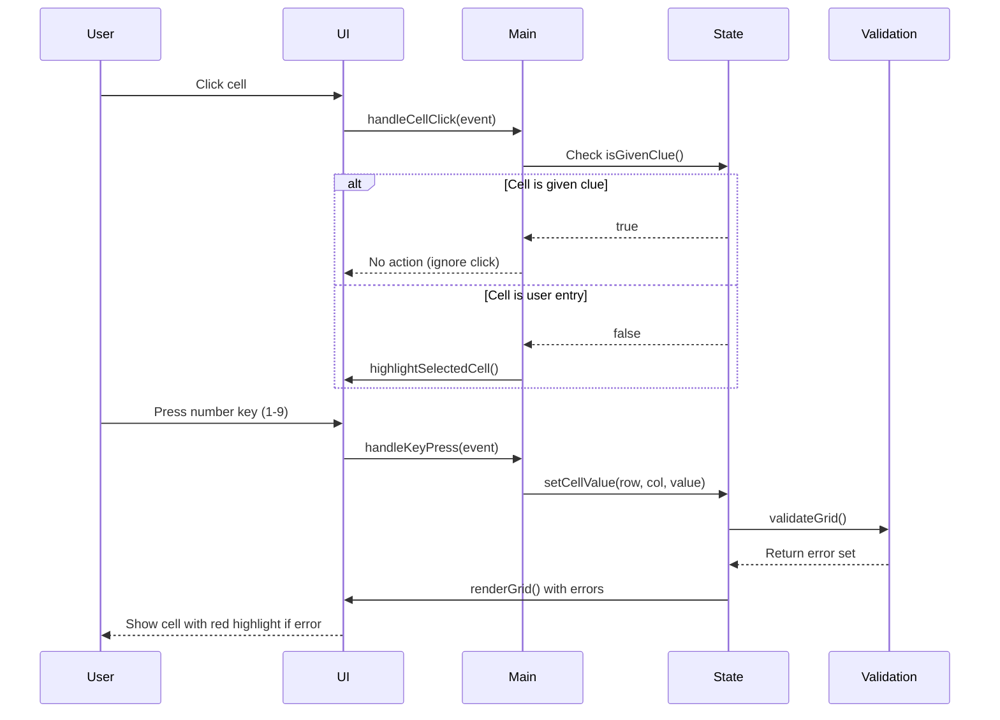
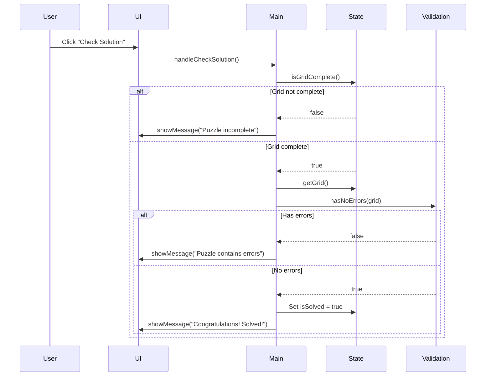
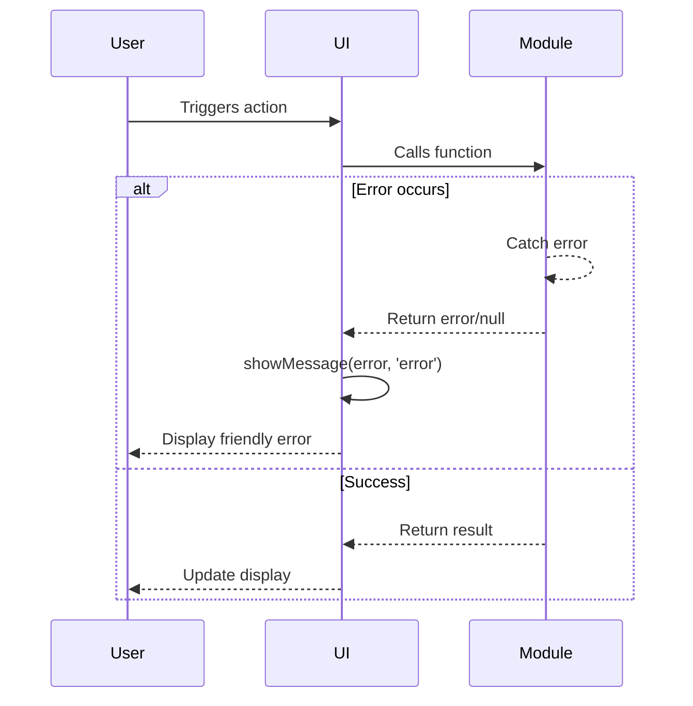

# Sudoku Web App Architecture Document

---

## Introduction

This document outlines the complete technical architecture for the Sudoku Web App, a client-side only application built with vanilla JavaScript, HTML5, and CSS3. The architecture emphasizes simplicity, maintainability, and educational value while delivering a fully functional Sudoku game with algorithmic puzzle generation.

This is a **greenfield project** with no starter templates or existing codebase. The architecture is designed from first principles to support zero-cost deployment, zero external dependencies, and straightforward AI-driven development.

### Change Log

| Date | Version | Description | Author |
|------|---------|-------------|--------|
| 2025-10-24 | 1.0 | Initial architecture document | Architect Winston |

---

## High Level Architecture

### Technical Summary

The Sudoku Web App is a pure client-side application deployed as a static site. The entire application runs in the browser using vanilla JavaScript (ES6+ modules), HTML5, and CSS3 with no frameworks, libraries, or build tools. The architecture follows a clean modular design with four primary modules: State Management (game data), Validation Logic (rule checking), Generation Logic (puzzle creation via backtracking), and UI Layer (rendering and interaction). All code executes client-side with no backend services, APIs, or databases. Static hosting on GitHub Pages, Netlify, or Vercel provides zero-cost deployment with automatic updates via git push. This architecture achieves the PRD's goals of simplicity, maintainability, and educational value while delivering complete Sudoku functionality.

### Platform and Infrastructure Choice

**Platform:** Static Site Hosting (GitHub Pages recommended)

**Key Services:**
- **GitHub Pages**: Free static hosting with automatic deployment from git repository
- **Git**: Version control and deployment trigger
- **Browser**: Complete runtime environment (no server needed)

**Deployment Host and Regions:**
- GitHub Pages: Global CDN distribution via GitHub's infrastructure
- Alternative: Netlify or Vercel (both offer comparable free static hosting with global CDNs)

**Rationale:** GitHub Pages is recommended because it's free, integrates directly with the repository, requires minimal configuration, and provides automatic deployment. The project already exists in a GitHub repository (implied by PRD), making this the path of least resistance. Netlify or Vercel are equally valid alternatives if drag-and-drop deployment or preview URLs are desired.

### Repository Structure

**Structure:** Monorepo (single repository)

**Monorepo Tool:** None - Simple flat structure sufficient for project scope

**Package Organization:**
- No package management or build tools required
- Direct file organization: HTML at root, CSS in `/styles/`, JavaScript in `/scripts/`, documentation in `/docs/`
- ES6 modules loaded directly by browser (native `import`/`export`)

**Rationale:** Given the small scope (single application, no shared packages), a complex monorepo tool (Nx, Turborepo, Lerna) would be over-engineering. A simple folder structure with ES6 modules provides sufficient organization while maintaining zero dependencies.

### High Level Architecture Diagram



### Architectural Patterns

- **Module Pattern:** ES6 modules with explicit imports/exports for clean separation of concerns - _Rationale:_ Native browser support eliminates need for bundlers while providing namespace isolation and clear dependencies

- **MVC-Inspired Architecture:** Model (state.js), View (ui.js), Controller (main.js coordinates between modules) - _Rationale:_ Familiar pattern that naturally separates data, presentation, and coordination logic

- **Immutable State Updates:** State mutations go through controlled update functions that validate and notify observers - _Rationale:_ Prevents accidental state corruption and makes data flow predictable

- **Algorithm Encapsulation:** Solver and generator algorithms isolated in dedicated module with pure functions - _Rationale:_ Complex backtracking logic is testable independently and doesn't leak into other concerns

- **Event-Driven UI:** DOM events trigger state updates, state changes trigger UI re-renders - _Rationale:_ Decouples user interactions from visual updates, making the system reactive

---

## Tech Stack

### Technology Stack Table

| Category | Technology | Version | Purpose | Rationale |
|----------|-----------|---------|---------|-----------|
| Frontend Language | JavaScript | ES6+ (ES2015+) | Core application logic | Modern language features (modules, arrow functions, const/let, template literals) with universal browser support |
| Frontend Framework | None (Vanilla JS) | N/A | Application structure | Zero dependencies reduces complexity, load time, and learning curve; sufficient for project scope |
| UI Component Library | None | N/A | UI components | Custom DOM manipulation adequate for simple single-screen interface |
| State Management | Custom (Plain Objects) | N/A | Game state tracking | Simple object/array state sufficient; no need for Redux/MobX complexity |
| Backend Language | None | N/A | Server-side logic | Client-side only application per PRD requirements |
| Backend Framework | None | N/A | API/Services | No backend needed |
| API Style | None | N/A | Data exchange | No API layer; all data generated client-side |
| Database | None | N/A | Data persistence | Puzzles generated on-demand; no persistence required for MVP |
| Cache | Browser Memory | N/A | Runtime state | Simple in-memory JavaScript objects |
| File Storage | None | N/A | Asset storage | HTML/CSS/JS served as static files from hosting |
| Authentication | None | N/A | User management | No user accounts or authentication needed |
| Frontend Testing | Manual | N/A | Code verification | Per PRD: manual exploratory testing for MVP |
| Backend Testing | N/A | N/A | API/Service testing | No backend to test |
| E2E Testing | Manual | N/A | End-to-end flows | Manual browser testing sufficient for MVP scope |
| Build Tool | None | N/A | Build process | Raw files deployed directly; no transpilation/bundling |
| Bundler | None | N/A | Module bundling | ES6 modules loaded natively by browser |
| IaC Tool | None | N/A | Infrastructure provisioning | Static hosting requires no infrastructure code |
| CI/CD | Git Push | N/A | Deployment automation | GitHub Pages deploys automatically on push to main/gh-pages branch |
| Monitoring | Browser DevTools | N/A | Error tracking | Console logging for development; no analytics per NFR8 |
| Logging | console.log | N/A | Debug logging | Browser console sufficient for development/debugging |
| CSS Framework | None (Custom CSS) | N/A | Styling | CSS Grid for layout; custom styles for complete control and zero dependencies |

---

## Data Models

### SudokuGrid

**Purpose:** Represents the complete game state including the puzzle grid, given clues, user entries, and validation state.

**Key Attributes:**
- `grid: number[][]` - 9x9 two-dimensional array (0 represents empty cell, 1-9 are values)
- `initialGrid: number[][]` - Immutable copy of puzzle's starting state (distinguishes given clues from user entries)
- `errors: Set<string>` - Cell coordinates with validation errors (format: "row,col")
- `isComplete: boolean` - Whether all cells are filled
- `isSolved: boolean` - Whether puzzle is correctly solved

**Relationships:**
- Single global instance managed by state.js
- Referenced by validation.js for rule checking
- Referenced by ui.js for rendering
- Modified by generator.js when creating new puzzles

#### TypeScript Interface

```typescript
interface SudokuGrid {
  grid: number[][];           // Current state: 9x9 array, 0 = empty, 1-9 = value
  initialGrid: number[][];    // Immutable puzzle starting state
  errors: Set<string>;        // Error cell coordinates "row,col"
  isComplete: boolean;        // All cells filled
  isSolved: boolean;          // Correctly solved
}

interface CellCoordinate {
  row: number;   // 0-8
  col: number;   // 0-8
}
```

**Note:** While this project uses vanilla JavaScript (no TypeScript), these interfaces document the expected data shapes for developer clarity and future TypeScript migration if desired.

---

## API Specification

**Not Applicable:** This application is entirely client-side with no backend services, APIs, or external integrations. All data is generated algorithmically in the browser.

---

## Components

### State Module (`scripts/state.js`)

**Responsibility:** Manages the game state including the current grid, initial puzzle configuration, validation errors, and game completion status. Provides controlled interface for state queries and mutations.

**Key Interfaces:**
- `getGrid()` - Returns current grid state
- `getInitialGrid()` - Returns immutable starting puzzle
- `getCellValue(row, col)` - Gets value at specific cell
- `setCellValue(row, col, value)` - Updates cell value and triggers validation
- `isGivenClue(row, col)` - Checks if cell is part of initial puzzle
- `clearCell(row, col)` - Removes user entry from cell
- `getErrors()` - Returns set of error cell coordinates
- `setErrors(errorSet)` - Updates validation error state
- `loadPuzzle(grid)` - Loads new puzzle and resets game state
- `isGridComplete()` - Checks if all cells are filled
- `isGridSolved()` - Checks if puzzle is correctly solved

**Dependencies:** None (pure data management)

**Technology Stack:** Vanilla JavaScript with ES6 module exports

---

### Validation Module (`scripts/validation.js`)

**Responsibility:** Implements Sudoku rule validation logic. Checks for duplicate numbers in rows, columns, and 3x3 boxes. Identifies all cells involved in rule violations.

**Key Interfaces:**
- `validateGrid(grid)` - Returns Set of error cell coordinates
- `validateCell(grid, row, col)` - Checks specific cell for violations
- `getRowConflicts(grid, row, col, value)` - Finds duplicate values in row
- `getColConflicts(grid, row, col, value)` - Finds duplicate values in column
- `getBoxConflicts(grid, row, col, value)` - Finds duplicate values in 3x3 box
- `hasNoErrors(grid)` - Returns true if grid has no rule violations

**Dependencies:**
- Imports state module to query grid data
- Called by state module after setCellValue

**Technology Stack:** Vanilla JavaScript with pure functions (no side effects)

---

### Generator Module (`scripts/generator.js`)

**Responsibility:** Generates valid Sudoku puzzles using backtracking algorithm. Creates complete solved grids, then removes numbers while ensuring unique solvability.

**Key Interfaces:**
- `generatePuzzle()` - Main entry point; returns 9x9 grid with ~40-50 given clues
- `generateSolvedGrid()` - Creates complete valid Sudoku grid using backtracking with randomization
- `removeCells(solvedGrid, targetClues)` - Strategically removes numbers to create puzzle
- `solvePuzzle(grid)` - Backtracking solver; returns solution or null
- `hasUniqueSolution(grid)` - Verifies puzzle has exactly one solution
- `countSolutions(grid, maxSolutions)` - Counts solutions up to limit (for uniqueness check)

**Dependencies:**
- Imports validation module to check grid validity
- Called by main module when user requests new puzzle

**Technology Stack:** Vanilla JavaScript with recursive algorithms

**Algorithm Notes:**
- Uses backtracking with randomized number order for variety
- Removes cells from solved grid and validates uniqueness after each removal
- If removal creates multiple solutions, that cell value is retained
- Target: 40-50 clues remaining (balanced difficulty)

---

### UI Module (`scripts/ui.js`)

**Responsibility:** Handles all DOM manipulation, rendering, and user interaction. Translates game state into visual representation and captures user input to update state.

**Key Interfaces:**
- `renderGrid(grid, errors, initialGrid)` - Renders entire 9x9 grid to DOM
- `renderCell(row, col, value, isGiven, hasError)` - Renders individual cell
- `highlightSelectedCell(row, col)` - Shows active cell selection
- `clearSelection()` - Removes cell selection highlight
- `showMessage(text, type)` - Displays user feedback (success/error/info)
- `showLoadingIndicator()` - Shows "Generating puzzle..." message
- `hideLoadingIndicator()` - Hides loading message
- `attachEventListeners()` - Sets up click and keyboard event handlers

**Dependencies:**
- Imports state module to query/update game state
- Imports validation module (indirectly via state)
- Called by main module to initialize and update UI

**Technology Stack:** Vanilla JavaScript with DOM APIs (querySelector, addEventListener, createElement)

**UI Patterns:**
- Event delegation for cell clicks
- Keyboard events on document level for number input
- CSS classes for styling states (selected, error, given-clue)

---

### Main Module (`scripts/main.js`)

**Responsibility:** Application entry point and coordinator. Initializes modules, orchestrates interactions between state/validation/generator/UI, handles high-level user actions (new puzzle, check solution).

**Key Interfaces:**
- `init()` - Application initialization: generate first puzzle, render UI, attach listeners
- `handleNewPuzzle()` - Generates new puzzle and updates state/UI
- `handleCheckSolution()` - Validates completion and displays result
- `handleCellClick(event)` - Delegates cell selection to state/UI
- `handleKeyPress(event)` - Delegates number input to state/UI

**Dependencies:** All other modules (state, validation, generator, ui)

**Technology Stack:** Vanilla JavaScript; runs on DOMContentLoaded event

---

### Component Diagram



---

## External APIs

**None Required:** This application has no external API integrations. All functionality (puzzle generation, validation, UI) is self-contained within the client-side JavaScript modules.

---

## Core Workflows

### New Puzzle Generation Workflow



### Cell Input and Validation Workflow



### Solution Verification Workflow



---

## Project Structure

```plaintext
sudoku-bmad/
├── index.html                  # Main entry point
├── styles/
│   └── sudoku.css              # All application styles
├── scripts/
│   ├── main.js                 # Application coordinator
│   ├── state.js                # Game state management
│   ├── validation.js           # Sudoku rule validation
│   ├── generator.js            # Puzzle generation algorithms
│   └── ui.js                   # DOM rendering and interaction
├── docs/
│   ├── brief.md                # Project brief
│   ├── prd.md                  # Product requirements document
│   ├── architecture.md         # This document
│   └── brainstorming-session-results.md
├── .gitignore                  # Git ignore rules
└── README.md                   # Project documentation

Notes:
- No node_modules/ (no dependencies)
- No build/ or dist/ (no build process)
- No package.json (no npm/yarn)
- Deploy directly from repository root
```

---

## Module Interfaces and Data Flow

### State Module Public API

```javascript
// state.js exports

export function getGrid() { /* returns current 9x9 grid */ }

export function getInitialGrid() { /* returns immutable starting puzzle */ }

export function getCellValue(row, col) { /* returns 0-9 */ }

export function setCellValue(row, col, value) {
  /* Updates cell, triggers validation, updates UI */
}

export function isGivenClue(row, col) {
  /* Compares against initialGrid */
}

export function clearCell(row, col) {
  /* Sets cell to 0 */
}

export function getErrors() {
  /* Returns Set<string> of "row,col" coordinates */
}

export function setErrors(errorSet) {
  /* Updates error state */
}

export function loadPuzzle(grid) {
  /* Loads new puzzle, resets game state */
}

export function isGridComplete() {
  /* Returns true if no empty cells */
}

export function isGridSolved() {
  /* Returns true if complete and no errors */
}
```

### Validation Module Public API

```javascript
// validation.js exports

export function validateGrid(grid) {
  /* Returns Set<string> of error cell coordinates */
}

export function hasNoErrors(grid) {
  /* Returns boolean */
}

// Internal helper functions (not exported)
function getRowConflicts(grid, row, col, value) { }
function getColConflicts(grid, row, col, value) { }
function getBoxConflicts(grid, row, col, value) { }
```

### Generator Module Public API

```javascript
// generator.js exports

export function generatePuzzle() {
  /* Returns 9x9 grid with ~40-50 clues */
}

// Internal functions (not exported)
function generateSolvedGrid() { }
function removeCells(solvedGrid, targetClues) { }
function solvePuzzle(grid) { }
function hasUniqueSolution(grid) { }
function countSolutions(grid, maxSolutions) { }
```

### UI Module Public API

```javascript
// ui.js exports

export function renderGrid(grid, errors, initialGrid) {
  /* Updates entire grid display */
}

export function highlightSelectedCell(row, col) {
  /* Adds 'selected' CSS class */
}

export function clearSelection() {
  /* Removes 'selected' CSS class */
}

export function showMessage(text, type) {
  /* Displays user feedback message */
}

export function showLoadingIndicator() { }

export function hideLoadingIndicator() { }

export function attachEventListeners(callbacks) {
  /* Sets up DOM event handlers with callback functions */
}
```

---

## HTML Structure

### index.html

```html
<!DOCTYPE html>
<html lang="en">
<head>
  <meta charset="UTF-8">
  <meta name="viewport" content="width=device-width, initial-scale=1.0">
  <title>Sudoku</title>
  <link rel="stylesheet" href="styles/sudoku.css">
</head>
<body>
  <main class="app-container">
    <header class="app-header">
      <h1>Sudoku</h1>
    </header>

    <div class="game-container">
      <!-- Grid generated dynamically by ui.js -->
      <div id="sudoku-grid" class="sudoku-grid">
        <!-- 81 cells (9x9) created by JavaScript -->
      </div>

      <div id="message" class="message hidden">
        <!-- Success/error messages displayed here -->
      </div>

      <div class="controls">
        <button id="new-puzzle-btn" class="btn btn-primary">New Puzzle</button>
        <button id="check-solution-btn" class="btn btn-secondary">Check Solution</button>
      </div>

      <div id="loading" class="loading hidden">
        <p>Generating puzzle...</p>
      </div>
    </div>
  </main>

  <script type="module" src="scripts/main.js"></script>
</body>
</html>
```

**Key Points:**
- Minimal semantic HTML structure
- `type="module"` on script tag enables ES6 imports
- Grid cells created dynamically (avoids 81 hardcoded divs)
- All interactive elements have IDs for easy selection

---

## CSS Architecture

### Styling Approach

**Layout Strategy:**
- CSS Grid for the 9x9 Sudoku grid (9 columns × 9 rows)
- Flexbox for overall page layout (centering, controls)
- Thicker borders every 3 cells to delineate 3x3 boxes

**Key CSS Classes:**
- `.sudoku-grid` - Grid container (display: grid)
- `.cell` - Individual cell styling
- `.cell.given-clue` - Given clue cells (bold, distinct color)
- `.cell.user-entry` - User-entered numbers (regular weight)
- `.cell.selected` - Currently selected cell (highlight)
- `.cell.error` - Cell with validation error (red background/border)
- `.btn` - Button base styles
- `.message` - Feedback message container
- `.hidden` - Display: none utility class

**Visual Design:**
- Clean, minimal aesthetic
- High contrast for readability
- Clear visual hierarchy (grid is focal point)
- Red for errors, blue for selection, gray for given clues

### styles/sudoku.css (Key Sections)

```css
/* Base styles */
* {
  box-sizing: border-box;
  margin: 0;
  padding: 0;
}

body {
  font-family: -apple-system, BlinkMacSystemFont, 'Segoe UI', Roboto, sans-serif;
  display: flex;
  justify-content: center;
  align-items: center;
  min-height: 100vh;
  background: #f5f5f5;
}

.app-container {
  max-width: 600px;
  padding: 2rem;
}

/* Sudoku Grid */
.sudoku-grid {
  display: grid;
  grid-template-columns: repeat(9, 1fr);
  grid-template-rows: repeat(9, 1fr);
  gap: 0;
  width: 100%;
  max-width: 500px;
  aspect-ratio: 1;
  margin: 1rem auto;
  border: 3px solid #333;
  background: white;
}

.cell {
  display: flex;
  align-items: center;
  justify-content: center;
  border: 1px solid #ddd;
  font-size: 1.5rem;
  cursor: pointer;
  user-select: none;
  transition: background-color 0.15s ease;
}

/* Thick borders for 3x3 boxes */
.cell:nth-child(3n) {
  border-right: 2px solid #333;
}

.cell:nth-child(n+19):nth-child(-n+27),
.cell:nth-child(n+46):nth-child(-n+54) {
  border-bottom: 2px solid #333;
}

/* Cell states */
.cell.given-clue {
  font-weight: bold;
  color: #333;
  background: #f9f9f9;
  cursor: default;
}

.cell.user-entry {
  font-weight: normal;
  color: #0066cc;
}

.cell.selected {
  background: #e3f2fd;
  outline: 2px solid #0066cc;
}

.cell.error {
  background: #ffebee;
  color: #c62828;
}

/* Controls */
.controls {
  display: flex;
  gap: 1rem;
  justify-content: center;
  margin-top: 1rem;
}

.btn {
  padding: 0.75rem 1.5rem;
  font-size: 1rem;
  border: none;
  border-radius: 4px;
  cursor: pointer;
  transition: all 0.2s ease;
}

.btn-primary {
  background: #0066cc;
  color: white;
}

.btn-primary:hover {
  background: #0052a3;
}

/* Messages */
.message {
  text-align: center;
  padding: 1rem;
  margin: 1rem 0;
  border-radius: 4px;
  font-weight: 500;
}

.message.success {
  background: #e8f5e9;
  color: #2e7d32;
}

.message.error {
  background: #ffebee;
  color: #c62828;
}

.message.info {
  background: #e3f2fd;
  color: #1565c0;
}

.hidden {
  display: none;
}

/* Loading indicator */
.loading {
  text-align: center;
  padding: 1rem;
  color: #666;
}
```

---

## Algorithm Implementations

### Backtracking Solver Pseudocode

```javascript
function solvePuzzle(grid) {
  // Find next empty cell (value === 0)
  const emptyCell = findEmptyCell(grid);

  // Base case: no empty cells = solved
  if (!emptyCell) {
    return grid; // Solution found
  }

  const { row, col } = emptyCell;

  // Try numbers 1-9 in this cell
  for (let num = 1; num <= 9; num++) {
    if (isValidPlacement(grid, row, col, num)) {
      // Place number
      grid[row][col] = num;

      // Recursively solve rest of grid
      if (solvePuzzle(grid)) {
        return grid; // Solution found downstream
      }

      // Backtrack: placement didn't lead to solution
      grid[row][col] = 0;
    }
  }

  // No valid number found: trigger backtracking
  return null;
}

function isValidPlacement(grid, row, col, num) {
  // Check row for duplicate
  for (let c = 0; c < 9; c++) {
    if (grid[row][c] === num) return false;
  }

  // Check column for duplicate
  for (let r = 0; r < 9; r++) {
    if (grid[r][col] === num) return false;
  }

  // Check 3x3 box for duplicate
  const boxRow = Math.floor(row / 3) * 3;
  const boxCol = Math.floor(col / 3) * 3;
  for (let r = boxRow; r < boxRow + 3; r++) {
    for (let c = boxCol; c < boxCol + 3; c++) {
      if (grid[r][c] === num) return false;
    }
  }

  return true; // Valid placement
}
```

### Puzzle Generator Pseudocode

```javascript
function generatePuzzle() {
  // Step 1: Generate complete solved grid
  const solvedGrid = generateSolvedGrid();

  // Step 2: Create copy for puzzle (will remove numbers)
  const puzzleGrid = JSON.parse(JSON.stringify(solvedGrid));

  // Step 3: Get list of all cell coordinates, shuffle randomly
  const cells = getAllCellCoordinates(); // Returns [{row, col}, ...]
  shuffleArray(cells);

  // Step 4: Try removing cells while maintaining unique solution
  const targetClues = 45; // Aim for ~45 given clues (moderate difficulty)
  let cluesRemaining = 81;

  for (const {row, col} of cells) {
    if (cluesRemaining <= targetClues) break;

    // Temporarily remove this number
    const removedValue = puzzleGrid[row][col];
    puzzleGrid[row][col] = 0;

    // Check if puzzle still has unique solution
    if (hasUniqueSolution(puzzleGrid)) {
      // Removal successful, keep it removed
      cluesRemaining--;
    } else {
      // Removal creates multiple solutions, restore value
      puzzleGrid[row][col] = removedValue;
    }
  }

  return puzzleGrid;
}

function generateSolvedGrid() {
  // Start with empty grid
  const grid = Array.from({ length: 9 }, () => Array(9).fill(0));

  // Use backtracking with randomized number order
  function fillGrid(grid) {
    const emptyCell = findEmptyCell(grid);
    if (!emptyCell) return true; // Grid complete

    const { row, col } = emptyCell;

    // Try numbers 1-9 in random order
    const numbers = [1, 2, 3, 4, 5, 6, 7, 8, 9];
    shuffleArray(numbers);

    for (const num of numbers) {
      if (isValidPlacement(grid, row, col, num)) {
        grid[row][col] = num;

        if (fillGrid(grid)) {
          return true; // Success
        }

        grid[row][col] = 0; // Backtrack
      }
    }

    return false; // Trigger backtracking
  }

  fillGrid(grid);
  return grid;
}

function hasUniqueSolution(grid) {
  const solutionCount = countSolutions(grid, 2); // Stop after finding 2
  return solutionCount === 1;
}

function countSolutions(grid, maxCount) {
  let count = 0;

  function solve(grid) {
    if (count >= maxCount) return; // Early exit optimization

    const emptyCell = findEmptyCell(grid);
    if (!emptyCell) {
      count++; // Found a solution
      return;
    }

    const { row, col } = emptyCell;

    for (let num = 1; num <= 9; num++) {
      if (isValidPlacement(grid, row, col, num)) {
        grid[row][col] = num;
        solve(grid);
        grid[row][col] = 0;
      }
    }
  }

  // Work on copy to avoid modifying input
  const gridCopy = JSON.parse(JSON.stringify(grid));
  solve(gridCopy);

  return count;
}
```

**Performance Optimization Notes:**
- `countSolutions` stops early after finding 2 solutions (no need to find all)
- Number order randomization in generator ensures variety
- Target 45 clues balances difficulty with generation speed
- If generation is slow, can reduce uniqueness checks or increase target clues

---

## Development Workflow

### Local Development Setup

#### Prerequisites

```bash
# No prerequisites! Just a modern browser and text editor.
# Recommended: VS Code with Live Server extension for auto-reload
```

#### Initial Setup

```bash
# Clone repository
git clone <repository-url>
cd sudoku-bmad

# No npm install, no build step - just open in browser!

# Option 1: Open index.html directly in browser
open index.html  # macOS
start index.html # Windows
xdg-open index.html # Linux

# Option 2: Use VS Code Live Server (recommended)
# Install "Live Server" extension
# Right-click index.html → "Open with Live Server"

# Option 3: Use Python simple HTTP server (avoids CORS issues with ES6 modules)
python3 -m http.server 8000
# Then open http://localhost:8000
```

#### Development Commands

```bash
# No build commands needed!

# Run tests (manual)
# 1. Open application in browser
# 2. Open browser DevTools console
# 3. Interact with application and verify functionality

# Check for syntax errors (optional - use ESLint)
npx eslint scripts/*.js  # If you want linting (not required)

# Format code (optional - use Prettier)
npx prettier --write scripts/*.js styles/*.css index.html
```

### Environment Configuration

**No environment variables needed** - this is a fully static, self-contained application with no configuration, API keys, or secrets.

---

## Deployment Architecture

### Deployment Strategy

**Platform:** GitHub Pages (Static Site Hosting)

**Build Command:** None (no build process)

**Output Directory:** Repository root (index.html at root, scripts/ and styles/ folders)

**CDN/Edge:** GitHub's global CDN (automatic)

**Deployment Trigger:** Push to `main` branch (or `gh-pages` branch if configured)

**Configuration Steps:**
1. Go to repository Settings → Pages
2. Set source to "Deploy from a branch"
3. Select branch: `main` (or `gh-pages`)
4. Select folder: `/ (root)`
5. Save
6. GitHub automatically deploys on every push
7. Site available at: `https://<username>.github.io/<repo-name>/`

**Alternative Platforms:**

**Netlify:**
- Drag-and-drop deployment or connect to git
- Build command: (leave empty)
- Publish directory: `/`
- Auto-deploys on git push

**Vercel:**
- Import git repository
- Framework preset: "Other"
- Build command: (leave empty)
- Output directory: `./`
- Auto-deploys on git push

### CI/CD Pipeline

**GitHub Actions (Optional - for linting/validation):**

```yaml
# .github/workflows/deploy.yml
name: Deploy

on:
  push:
    branches: [ main ]

jobs:
  deploy:
    runs-on: ubuntu-latest

    steps:
      - uses: actions/checkout@v3

      # Optional: Run ESLint
      - name: Lint JavaScript
        run: npx eslint scripts/*.js --max-warnings 0

      # Optional: Validate HTML
      - name: Validate HTML
        run: npx html-validate index.html

      # GitHub Pages deploys automatically from main branch
      # No deploy step needed if Pages is configured
```

**Note:** CI/CD is optional for this project. GitHub Pages auto-deployment on push is sufficient for MVP.

### Environments

| Environment | Frontend URL | Backend URL | Purpose |
|-------------|-------------|-------------|---------|
| Development | http://localhost:8000 | N/A | Local development with live reload |
| Production | https://\<username\>.github.io/\<repo\> | N/A | Live deployed application |

**Note:** No staging environment needed for MVP. Can add preview deployments later using Netlify Deploy Previews or Vercel Preview URLs if desired.

---

## Performance Optimization

### Performance Targets

**From PRD:**
- NFR1: Puzzle generation < 2 seconds
- NFR2: UI interactions < 100 milliseconds

### Optimization Strategies

**Puzzle Generation Performance:**
- Early termination in `countSolutions` after finding 2 solutions
- Limit cell removal attempts to reasonable threshold
- If generation consistently exceeds 2 seconds:
  - Increase target clues (45→50) for faster generation
  - Reduce uniqueness verification rigor (accept 1-2 solutions)
  - Post-MVP: Move generation to Web Worker (non-blocking)

**UI Performance:**
- CSS transitions limited to 150ms for smooth feel
- Event delegation minimizes event listener count
- Selective DOM updates (only re-render changed cells if needed)
- Avoid layout thrashing (batch DOM reads/writes)

**Load Time:**
- No external dependencies = minimal JS payload
- ES6 modules = native browser loading (no bundle parsing)
- Inline critical CSS or use single small CSS file
- Minimal HTML = fast initial parse

**Browser Caching:**
- Static files automatically cached by browser
- GitHub Pages sets appropriate cache headers

---

## Security Considerations

### Security Requirements

**Frontend Security:**
- **CSP Headers:** Not applicable for GitHub Pages (no control over headers); acceptable for MVP as no user data or sensitive operations
- **XSS Prevention:** No user-generated content rendered; numbers 0-9 only (no string injection risk)
- **Secure Storage:** No data stored; game state exists only in memory during session

**Authentication Security:**
- Not applicable (no authentication system)

**Data Privacy:**
- NFR8: No user data collection, storage, or transmission
- No cookies, no localStorage (for MVP), no analytics
- Complete user privacy by design

### Security Best Practices

- Input validation: Only accept numbers 1-9 (already constrained by game logic)
- No eval() or Function constructor usage
- No external script loading (no CDN dependencies)
- HTTPS enforced by GitHub Pages (automatic)

---

## Testing Strategy

### Testing Approach

**Manual Testing Only (Per PRD):**
Testing will be manual and exploratory, verifying each functional requirement through direct browser interaction.

### Test Organization

**Testing Checklist:**

1. **Grid Display (Story 1.2):**
   - Verify 9x9 grid renders correctly
   - Check 3x3 box borders are visible
   - Confirm given clues are styled distinctly

2. **Cell Selection (Story 1.3):**
   - Click empty cells and verify selection highlight
   - Confirm given clue cells cannot be selected
   - Test keyboard input (1-9, Delete, Backspace)

3. **Validation (Story 1.4):**
   - Enter duplicate numbers in same row → verify red highlight
   - Enter duplicate numbers in same column → verify red highlight
   - Enter duplicate numbers in same 3x3 box → verify red highlight
   - Fix errors and verify red highlight clears

4. **Solution Verification (Story 1.5):**
   - Click "Check Solution" with incomplete grid → verify message
   - Complete grid with errors → verify error message
   - Complete grid correctly → verify success message

5. **Puzzle Generation (Story 2.2, 2.3):**
   - Click "New Puzzle" → verify puzzle generates within 2 seconds
   - Generate multiple puzzles → verify they're different
   - Verify generated puzzles are solvable

6. **Browser Compatibility (NFR3):**
   - Test on Chrome (latest 2 versions)
   - Test on Firefox (latest 2 versions)
   - Test on Safari (latest 2 versions)
   - Test on Edge (latest 2 versions)

7. **Mobile Responsiveness:**
   - Open on mobile device (iPhone, Android)
   - Verify grid is visible and usable
   - Test touch input (tapping cells, keyboard)

### Testing Examples (Manual Test Cases)

**Test Case 1: Basic Gameplay Flow**
1. Open application in browser
2. Observe: A Sudoku puzzle is displayed automatically
3. Click an empty cell
4. Expected: Cell is highlighted (blue background)
5. Type a number 1-9
6. Expected: Number appears in cell
7. Type the same number in another cell in the same row
8. Expected: Both cells turn red (error highlight)
9. Change one of the numbers to a different value
10. Expected: Red highlight disappears

**Test Case 2: Puzzle Generation**
1. Click "New Puzzle" button
2. Expected: Loading message appears briefly
3. Expected: New puzzle appears within 2 seconds
4. Expected: New puzzle is different from previous
5. Repeat 3-5 times to verify variety

**Post-MVP Enhancement:**
If the project continues beyond MVP, consider adding:
- Unit tests for validation logic (Jest)
- Unit tests for generator/solver algorithms
- E2E tests for critical flows (Playwright)

---

## Coding Standards

### Critical Rules

- **Module Imports:** Always use explicit imports at top of file; no dynamic imports for core modules

- **State Mutations:** All state changes must go through state.js public API; never modify state object directly from other modules

- **Error Handling:** Wrap generator functions in try-catch; display user-friendly error messages via ui.showMessage()

- **Console Logging:** Use console.log for development; remove or comment out before deployment (no production logs per NFR8)

- **DOM Queries:** Cache DOM element references in ui.js; avoid repeated querySelectorAll() calls in loops

- **Grid Indexing:** Always use 0-based indexing (0-8 for rows/cols); validate indices are in range before array access

- **Deep Copying:** Use JSON.parse(JSON.stringify()) for cloning grids; avoid accidental mutations of initialGrid

### Naming Conventions

| Element | Convention | Example |
|---------|-----------|---------|
| Files | kebab-case | `puzzle-generator.js` (if multi-word) |
| Functions | camelCase | `generatePuzzle()`, `validateCell()` |
| Variables | camelCase | `selectedCell`, `errorSet` |
| Constants | UPPER_SNAKE_CASE | `GRID_SIZE`, `TARGET_CLUES` |
| CSS Classes | kebab-case | `.sudoku-grid`, `.given-clue` |
| CSS IDs | kebab-case | `#new-puzzle-btn` |

### Code Organization Standards

**File Organization:**
- One module per file
- Imports at top
- Constants after imports
- Helper functions (internal) before public API
- Exports at bottom

**Function Standards:**
- Keep functions focused (single responsibility)
- Aim for < 20 lines per function
- Complex functions (like backtracking) can be longer but should have clear comments
- Pure functions preferred (no side effects)

**Comment Standards:**
- JSDoc for public API functions
- Inline comments for complex algorithms (especially backtracking)
- No redundant comments (code should be self-documenting where possible)

**Example Function Documentation:**

```javascript
/**
 * Validates the entire Sudoku grid and returns all cells with errors.
 *
 * @param {number[][]} grid - 9x9 array representing the Sudoku grid
 * @returns {Set<string>} Set of error cell coordinates in "row,col" format
 */
export function validateGrid(grid) {
  const errors = new Set();
  // ... implementation
  return errors;
}
```

---

## Error Handling Strategy

### Error Flow



### Error Handling Patterns

**Generator Module:**
```javascript
export function generatePuzzle() {
  try {
    const solvedGrid = generateSolvedGrid();
    if (!solvedGrid) {
      throw new Error('Failed to generate solved grid');
    }

    const puzzle = removeCells(solvedGrid, 45);
    return puzzle;

  } catch (error) {
    console.error('Puzzle generation failed:', error);
    return null; // Signal failure to caller
  }
}
```

**Main Module (Handling Errors):**
```javascript
async function handleNewPuzzle() {
  ui.showLoadingIndicator();

  const puzzle = generator.generatePuzzle();

  ui.hideLoadingIndicator();

  if (!puzzle) {
    ui.showMessage('Failed to generate puzzle. Please try again.', 'error');
    return;
  }

  state.loadPuzzle(puzzle);
  ui.renderGrid(state.getGrid(), state.getErrors(), state.getInitialGrid());
  ui.showMessage('New puzzle loaded!', 'info');
}
```

**User-Facing Error Messages:**
- "Failed to generate puzzle. Please try again." (generation timeout/failure)
- "Puzzle is incomplete." (solution check with empty cells)
- "Puzzle contains errors." (solution check with rule violations)
- No error messages for invalid keyboard input (simply ignore non-1-9 keys)

---

## Future Enhancements (Post-MVP)

While out of scope for MVP, the architecture supports these potential extensions:

**Phase 2 Features (from PRD):**
- **Difficulty Levels:** Modify generator to target different clue counts (easy: 45-50, medium: 35-40, hard: 28-32)
- **Undo/Redo:** Add action history array in state.js; implement undo/redo stack
- **Pencil Marks:** Extend grid data structure to include candidate arrays per cell
- **Save State:** Add localStorage persistence in state.js
- **Keyboard Navigation:** Add arrow key handlers for cell selection without mouse

**Performance Optimizations:**
- **Web Workers:** Move puzzle generation to background thread for non-blocking UI
- **Memoization:** Cache solved grids to speed up subsequent generation
- **Incremental Rendering:** Only re-render changed cells instead of entire grid

**Code Quality Enhancements:**
- **TypeScript Migration:** Add type safety without runtime overhead
- **Unit Tests:** Jest tests for validation and generator modules
- **E2E Tests:** Playwright for critical user flows
- **Build Process:** Vite for bundling/minification (still zero-cost deployment)

**Accessibility:**
- Keyboard navigation with Tab/Arrow keys
- ARIA labels for screen readers
- High contrast mode
- Focus indicators

---

## Checklist Results Report

*(This section will be populated by executing the architect checklist after architecture completion)*

The checklist validates:
- Architecture completeness and clarity
- Alignment with PRD requirements
- Technical feasibility
- Readiness for implementation

---

## Summary and Next Steps

### Architecture Summary

This architecture document defines a **simple, maintainable, and educational client-side Sudoku application** using vanilla JavaScript, HTML5, and CSS3. The design prioritizes:

✅ **Zero Dependencies:** No frameworks, libraries, or build tools
✅ **Zero Cost:** Static hosting on GitHub Pages (or Netlify/Vercel)
✅ **Clean Modularity:** Four focused modules (state, validation, generator, UI)
✅ **Clear Interfaces:** Well-defined public APIs and data flows
✅ **Performance:** Meets NFR1 (generation < 2s) and NFR2 (UI < 100ms)
✅ **Simplicity:** Straightforward implementation enabling AI-driven development

### Implementation Readiness

All requirements from the PRD are addressed:
- **13 Functional Requirements:** Mapped to specific modules and functions
- **8 Non-Functional Requirements:** Architectural decisions ensure compliance
- **9 User Stories:** Clear implementation path through Epic 1 → Epic 2

### Handoff to Development

**For AI Development Agent:**

You now have everything needed to implement the Sudoku application by following the PRD's story sequence (Story 1.1 → 1.2 → 1.3 → 1.4 → 1.5 → 2.1 → 2.2 → 2.3 → 2.4). This architecture document provides:

1. **Module Structure:** Create the 5 JavaScript files (main.js, state.js, validation.js, generator.js, ui.js)
2. **Function Signatures:** Implement the public APIs documented in "Module Interfaces and Data Flow"
3. **Algorithm Guidance:** Use the pseudocode in "Algorithm Implementations" for solver/generator
4. **HTML/CSS:** Use the structures provided in "HTML Structure" and "CSS Architecture"
5. **Testing:** Verify against acceptance criteria in each story

**Start with Story 1.1:** Create the repository structure, basic HTML, and deploy to GitHub Pages. Then proceed sequentially through each story, using this document as the technical reference.

---

*Architecture document created using the BMAD-METHOD™ framework*
*Based on PRD (2025-10-24)*
*Architect: Winston 🏗️*