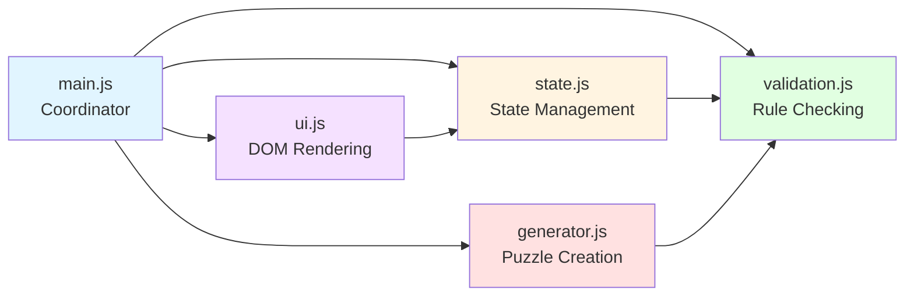

# Components

## State Module (`scripts/state.js`)

**Responsibility:** Manages the game state including the current grid, initial puzzle configuration, validation errors, and game completion status. Provides controlled interface for state queries and mutations.

**Key Interfaces:**
- `getGrid()` - Returns current grid state
- `getInitialGrid()` - Returns immutable starting puzzle
- `getCellValue(row, col)` - Gets value at specific cell
- `setCellValue(row, col, value)` - Updates cell value and triggers validation
- `isGivenClue(row, col)` - Checks if cell is part of initial puzzle
- `clearCell(row, col)` - Removes user entry from cell
- `getErrors()` - Returns set of error cell coordinates
- `setErrors(errorSet)` - Updates validation error state
- `loadPuzzle(grid)` - Loads new puzzle and resets game state
- `isGridComplete()` - Checks if all cells are filled
- `isGridSolved()` - Checks if puzzle is correctly solved

**Dependencies:** None (pure data management)

**Technology Stack:** Vanilla JavaScript with ES6 module exports

---

## Validation Module (`scripts/validation.js`)

**Responsibility:** Implements Sudoku rule validation logic. Checks for duplicate numbers in rows, columns, and 3x3 boxes. Identifies all cells involved in rule violations.

**Key Interfaces:**
- `validateGrid(grid)` - Returns Set of error cell coordinates
- `validateCell(grid, row, col)` - Checks specific cell for violations
- `getRowConflicts(grid, row, col, value)` - Finds duplicate values in row
- `getColConflicts(grid, row, col, value)` - Finds duplicate values in column
- `getBoxConflicts(grid, row, col, value)` - Finds duplicate values in 3x3 box
- `hasNoErrors(grid)` - Returns true if grid has no rule violations

**Dependencies:**
- Imports state module to query grid data
- Called by state module after setCellValue

**Technology Stack:** Vanilla JavaScript with pure functions (no side effects)

---

## Generator Module (`scripts/generator.js`)

**Responsibility:** Generates valid Sudoku puzzles using backtracking algorithm. Creates complete solved grids, then removes numbers while ensuring unique solvability.

**Key Interfaces:**
- `generatePuzzle()` - Main entry point; returns 9x9 grid with ~40-50 given clues
- `generateSolvedGrid()` - Creates complete valid Sudoku grid using backtracking with randomization
- `removeCells(solvedGrid, targetClues)` - Strategically removes numbers to create puzzle
- `solvePuzzle(grid)` - Backtracking solver; returns solution or null
- `hasUniqueSolution(grid)` - Verifies puzzle has exactly one solution
- `countSolutions(grid, maxSolutions)` - Counts solutions up to limit (for uniqueness check)

**Dependencies:**
- Imports validation module to check grid validity
- Called by main module when user requests new puzzle

**Technology Stack:** Vanilla JavaScript with recursive algorithms

**Algorithm Notes:**
- Uses backtracking with randomized number order for variety
- Removes cells from solved grid and validates uniqueness after each removal
- If removal creates multiple solutions, that cell value is retained
- Target: 40-50 clues remaining (balanced difficulty)

---

## UI Module (`scripts/ui.js`)

**Responsibility:** Handles all DOM manipulation, rendering, and user interaction. Translates game state into visual representation and captures user input to update state.

**Key Interfaces:**
- `renderGrid(grid, errors, initialGrid)` - Renders entire 9x9 grid to DOM
- `renderCell(row, col, value, isGiven, hasError)` - Renders individual cell
- `highlightSelectedCell(row, col)` - Shows active cell selection
- `clearSelection()` - Removes cell selection highlight
- `showMessage(text, type)` - Displays user feedback (success/error/info)
- `showLoadingIndicator()` - Shows "Generating puzzle..." message
- `hideLoadingIndicator()` - Hides loading message
- `attachEventListeners()` - Sets up click and keyboard event handlers

**Dependencies:**
- Imports state module to query/update game state
- Imports validation module (indirectly via state)
- Called by main module to initialize and update UI

**Technology Stack:** Vanilla JavaScript with DOM APIs (querySelector, addEventListener, createElement)

**UI Patterns:**
- Event delegation for cell clicks
- Keyboard events on document level for number input
- CSS classes for styling states (selected, error, given-clue)

---

## Main Module (`scripts/main.js`)

**Responsibility:** Application entry point and coordinator. Initializes modules, orchestrates interactions between state/validation/generator/UI, handles high-level user actions (new puzzle, check solution).

**Key Interfaces:**
- `init()` - Application initialization: generate first puzzle, render UI, attach listeners
- `handleNewPuzzle()` - Generates new puzzle and updates state/UI
- `handleCheckSolution()` - Validates completion and displays result
- `handleCellClick(event)` - Delegates cell selection to state/UI
- `handleKeyPress(event)` - Delegates number input to state/UI

**Dependencies:** All other modules (state, validation, generator, ui)

**Technology Stack:** Vanilla JavaScript; runs on DOMContentLoaded event

---

## Component Diagram

