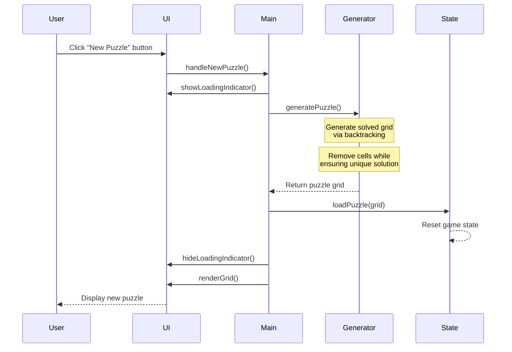
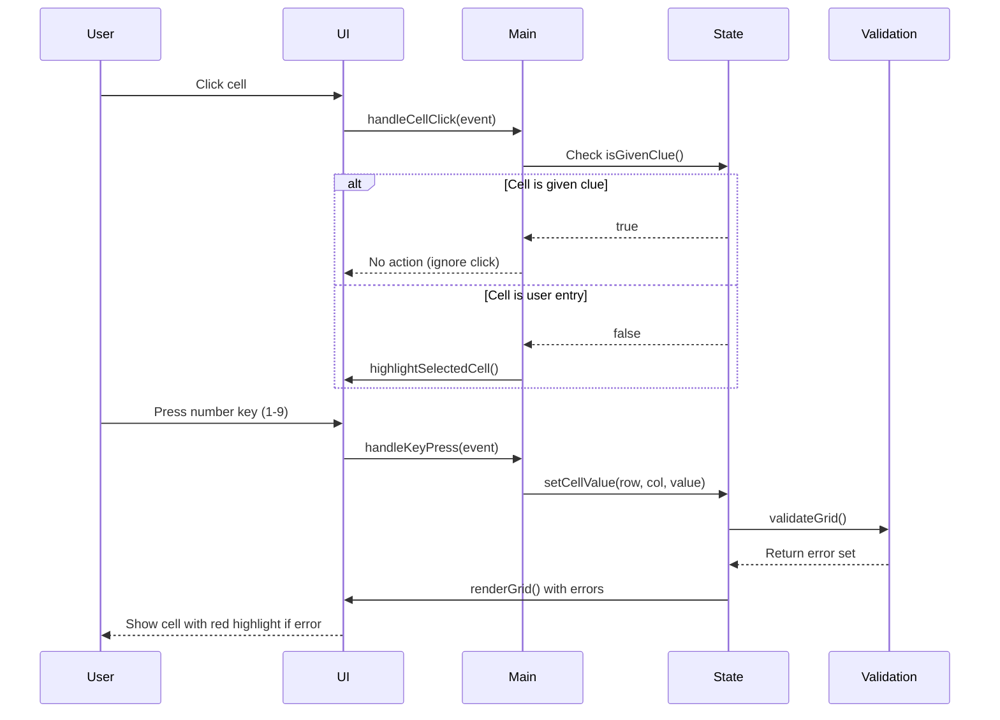
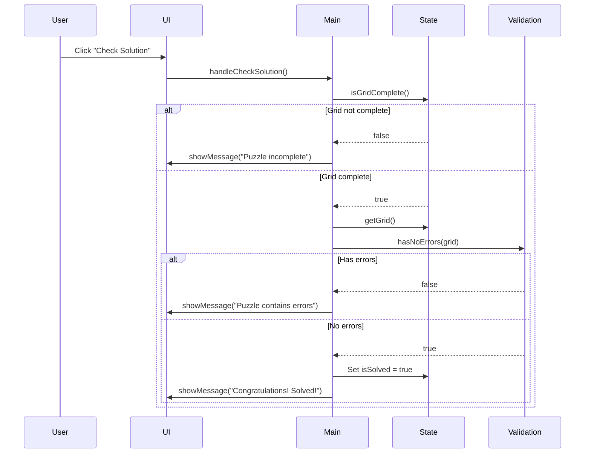

# Core Workflows

## New Puzzle Generation Workflow

```mermaid
sequenceDiagram
    participant User
    participant UI
    participant Main
    participant Generator
    participant State

    User->>UI: Click "New Puzzle" button
    UI->>Main: handleNewPuzzle()
    Main->>UI: showLoadingIndicator()
    Main->>Generator: generatePuzzle()

    Note over Generator: Generate solved grid<br/>via backtracking
    Note over Generator: Remove cells while<br/>ensuring unique solution

    Generator-->>Main: Return puzzle grid
    Main->>State: loadPuzzle(grid)
    State-->>State: Reset game state
    Main->>UI: hideLoadingIndicator()
    Main->>UI: renderGrid()
    UI-->>User: Display new puzzle
```

## Cell Input and Validation Workflow

```mermaid
sequenceDiagram
    participant User
    participant UI
    participant Main
    participant State
    participant Validation

    User->>UI: Click cell
    UI->>Main: handleCellClick(event)
    Main->>State: Check isGivenClue()

    alt Cell is given clue
        State-->>Main: true
        Main-->>UI: No action (ignore click)
    else Cell is user entry
        State-->>Main: false
        Main->>UI: highlightSelectedCell()
    end

    User->>UI: Press number key (1-9)
    UI->>Main: handleKeyPress(event)
    Main->>State: setCellValue(row, col, value)
    State->>Validation: validateGrid()
    Validation-->>State: Return error set
    State->>UI: renderGrid() with errors
    UI-->>User: Show cell with red highlight if error
```

## Solution Verification Workflow

```mermaid
sequenceDiagram
    participant User
    participant UI
    participant Main
    participant State
    participant Validation

    User->>UI: Click "Check Solution"
    UI->>Main: handleCheckSolution()
    Main->>State: isGridComplete()

    alt Grid not complete
        State-->>Main: false
        Main->>UI: showMessage("Puzzle incomplete")
    else Grid complete
        State-->>Main: true
        Main->>State: getGrid()
        Main->>Validation: hasNoErrors(grid)

        alt Has errors
            Validation-->>Main: false
            Main->>UI: showMessage("Puzzle contains errors")
        else No errors
            Validation-->>Main: true
            Main->>State: Set isSolved = true
            Main->>UI: showMessage("Congratulations! Solved!")
        end
    end
```