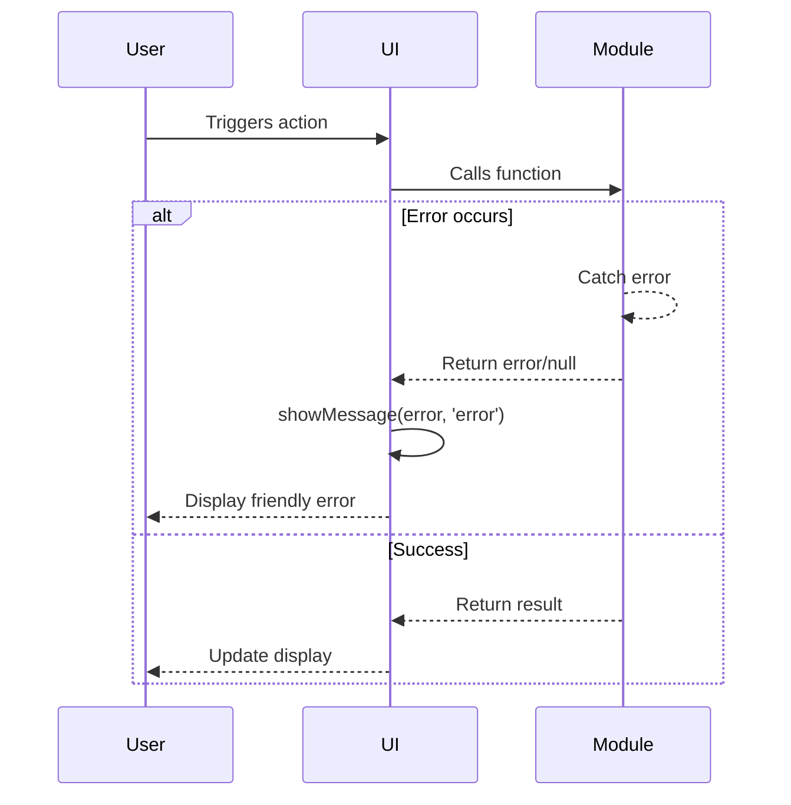

# Error Handling Strategy

## Error Flow



## Error Handling Patterns

**Generator Module:**
```javascript
export function generatePuzzle() {
  try {
    const solvedGrid = generateSolvedGrid();
    if (!solvedGrid) {
      throw new Error('Failed to generate solved grid');
    }

    const puzzle = removeCells(solvedGrid, 45);
    return puzzle;

  } catch (error) {
    console.error('Puzzle generation failed:', error);
    return null; // Signal failure to caller
  }
}
```

**Main Module (Handling Errors):**
```javascript
async function handleNewPuzzle() {
  ui.showLoadingIndicator();

  const puzzle = generator.generatePuzzle();

  ui.hideLoadingIndicator();

  if (!puzzle) {
    ui.showMessage('Failed to generate puzzle. Please try again.', 'error');
    return;
  }

  state.loadPuzzle(puzzle);
  ui.renderGrid(state.getGrid(), state.getErrors(), state.getInitialGrid());
  ui.showMessage('New puzzle loaded!', 'info');
}
```

**User-Facing Error Messages:**
- "Failed to generate puzzle. Please try again." (generation timeout/failure)
- "Puzzle is incomplete." (solution check with empty cells)
- "Puzzle contains errors." (solution check with rule violations)
- No error messages for invalid keyboard input (simply ignore non-1-9 keys)