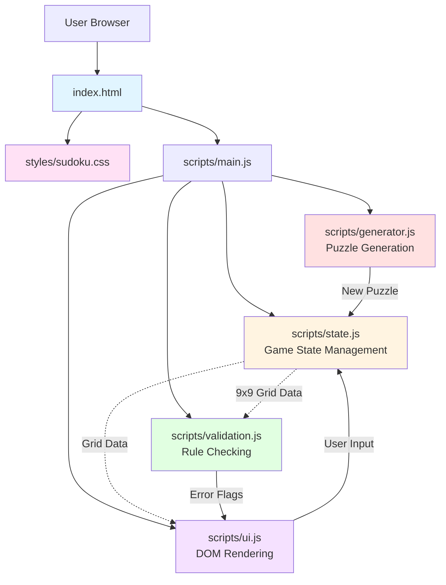

# High Level Architecture

## Technical Summary

The Sudoku Web App is a pure client-side application deployed as a static site. The entire application runs in the browser using vanilla JavaScript (ES6+ modules), HTML5, and CSS3 with no frameworks, libraries, or build tools. The architecture follows a clean modular design with four primary modules: State Management (game data), Validation Logic (rule checking), Generation Logic (puzzle creation via backtracking), and UI Layer (rendering and interaction). All code executes client-side with no backend services, APIs, or databases. Static hosting on GitHub Pages, Netlify, or Vercel provides zero-cost deployment with automatic updates via git push. This architecture achieves the PRD's goals of simplicity, maintainability, and educational value while delivering complete Sudoku functionality.

## Platform and Infrastructure Choice

**Platform:** Static Site Hosting (GitHub Pages recommended)

**Key Services:**
- **GitHub Pages**: Free static hosting with automatic deployment from git repository
- **Git**: Version control and deployment trigger
- **Browser**: Complete runtime environment (no server needed)

**Deployment Host and Regions:**
- GitHub Pages: Global CDN distribution via GitHub's infrastructure
- Alternative: Netlify or Vercel (both offer comparable free static hosting with global CDNs)

**Rationale:** GitHub Pages is recommended because it's free, integrates directly with the repository, requires minimal configuration, and provides automatic deployment. The project already exists in a GitHub repository (implied by PRD), making this the path of least resistance. Netlify or Vercel are equally valid alternatives if drag-and-drop deployment or preview URLs are desired.

## Repository Structure

**Structure:** Monorepo (single repository)

**Monorepo Tool:** None - Simple flat structure sufficient for project scope

**Package Organization:**
- No package management or build tools required
- Direct file organization: HTML at root, CSS in `/styles/`, JavaScript in `/scripts/`, documentation in `/docs/`
- ES6 modules loaded directly by browser (native `import`/`export`)

**Rationale:** Given the small scope (single application, no shared packages), a complex monorepo tool (Nx, Turborepo, Lerna) would be over-engineering. A simple folder structure with ES6 modules provides sufficient organization while maintaining zero dependencies.

## High Level Architecture Diagram

## Architectural Patterns

- **Module Pattern:** ES6 modules with explicit imports/exports for clean separation of concerns - _Rationale:_ Native browser support eliminates need for bundlers while providing namespace isolation and clear dependencies

- **MVC-Inspired Architecture:** Model (state.js), View (ui.js), Controller (main.js coordinates between modules) - _Rationale:_ Familiar pattern that naturally separates data, presentation, and coordination logic

- **Immutable State Updates:** State mutations go through controlled update functions that validate and notify observers - _Rationale:_ Prevents accidental state corruption and makes data flow predictable

- **Algorithm Encapsulation:** Solver and generator algorithms isolated in dedicated module with pure functions - _Rationale:_ Complex backtracking logic is testable independently and doesn't leak into other concerns

- **Event-Driven UI:** DOM events trigger state updates, state changes trigger UI re-renders - _Rationale:_ Decouples user interactions from visual updates, making the system reactive